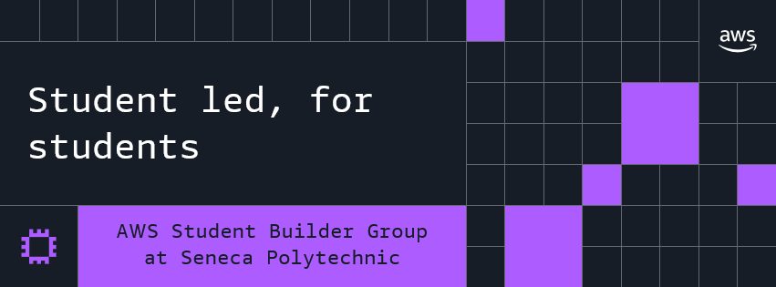

# AWS Student Builder Group @ Seneca Polytechnic

A student-run club at Seneca Polytechnic, Newnham Campus, Toronto. We learn cloud by building real things on AWS: core services, system design, DevOps, and getting hired.

No gatekeeping. Curiosity is the only credential. Events are free and open to any Seneca student.

- **Website:** [awsseneca.com](https://awsseneca.com)
- **Events and RSVPs:** [Meetup](https://www.meetup.com/aws-sbg-at-seneca-polytechnic-newnham-campus/)
- **All our links:** [linktr.ee/awsseneca](https://linktr.ee/awsseneca)
- **Club info, event plans, and slides:** [aws-seneca/info](https://github.com/aws-seneca/info)
- **Want to run a session or pitch an idea?** [Open an issue](https://github.com/aws-seneca/info/issues/new/choose)
